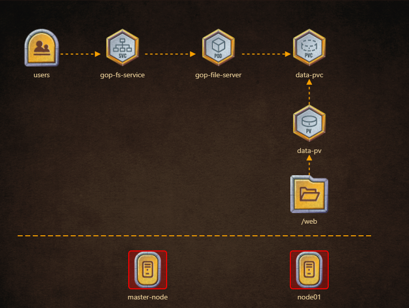

# Solution to game of pods:pento


## gop-fs-service

```
apiVersion: v1
kind: Service
metadata:
  labels:
    app: bravo
  name: gop-fs-service
spec:
  ports:
  - port: 8080
    protocol: TCP
    targetPort: 8080
  selector:
    app: bravo
  type: NodePort
```
