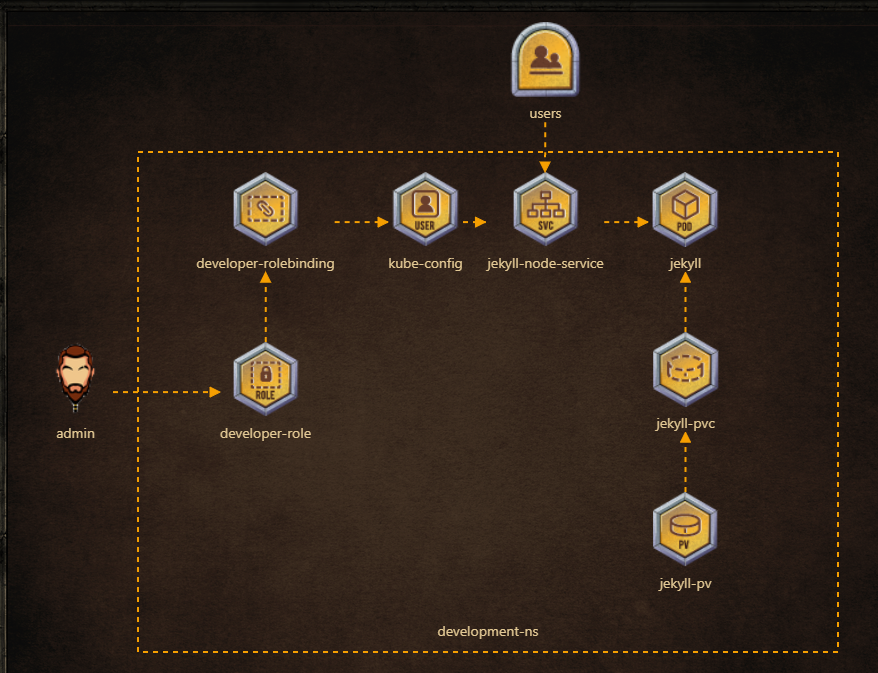

# Solution to game of pods:redis islands


## jekyll-node-service
```
apiVersion: v1
kind: Service
metadata:
  name: jekyll
  namespace: development
spec:
  ports:
  - name: 8080-4000
    nodePort: 30097
    port: 8080
    protocol: TCP
    targetPort: 4000
  type: NodePort
```
## jekyll-pvc
```
apiVersion: v1
kind: PersistentVolumeClaim
metadata:
  name: jekyll-site
  namespace: development
spec:
  accessModes:
    - ReadWriteMany
  volumeMode: Filesystem
  resources:
    requests:
      storage: 1Gi
  storageClassName: ""
```

## jekyll
```
apiVersion: apps/v1
kind: Deployment
metadata:
  labels:
    app: jekyll
  name: jekyll
spec:
  replicas: 1
  selector:
    matchLabels:
      app: jekyll
  strategy: {}
  template:
    metadata:
      creationTimestamp: null
      labels:
        app: jekyll
    spec:
      containers:
      - image: kodekloud/jekyll
        name: jekyll
```

